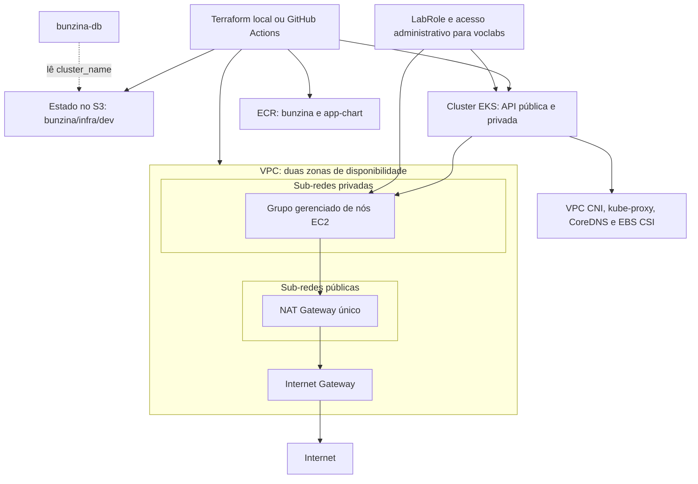

# bunzina-infra

## Propósito

Provisionar, com Terraform, a infraestrutura AWS compartilhada do Bunzina: rede, cluster Kubernetes e repositórios de artefatos. Este repositório prepara a plataforma para receber o banco de dados e a aplicação.

A ordem de implantação é **bunzina-infra → [bunzina-db](https://github.com/Bunzina/bunzina-db) → [aplicação Bunzina](https://github.com/Bunzina/bunzina)**. O banco de dados consome o estado remoto desta infraestrutura para descobrir o nome do cluster.

## Tecnologias utilizadas

| Tecnologia | Uso neste repositório |
| --- | --- |
| Terraform >= 1.11 | Provisionamento e estado remoto no S3; o workflow utiliza 1.11.4 |
| Provider AWS `~> 5.0` | Gerenciamento dos recursos AWS |
| Módulo VPC `~> 5.21` | VPC, sub-redes, rotas e NAT Gateway |
| Amazon EKS e EC2 | Kubernetes com versão padrão configurada `1.32` e grupo de nós gerenciado |
| Complementos EKS | VPC CNI, kube-proxy, CoreDNS e driver CSI do EBS |
| Amazon ECR | Repositórios da imagem da aplicação e do chart Helm |
| AWS CLI e kubectl | Autenticação e verificação do cluster |
| GitHub Actions | Plano em pull requests e deploy manual |

## Arquitetura



A VPC utiliza `10.0.0.0/16` por padrão, com uma sub-rede pública e uma privada em cada zona. O grupo de nós usa `t3.medium`, com dois nós desejados, mínimo de um e máximo de quatro. O ECR da aplicação verifica imagens no envio e mantém as dez mais recentes.

O PostgreSQL, sua StorageClass e seu volume são gerenciados pelo `bunzina-db`. A publicação das imagens e a implantação da aplicação ficam no repositório da aplicação.

## Pré-requisitos

- Terraform >= 1.11, AWS CLI e kubectl instalados.
- Credenciais AWS válidas e permissões para criar os recursos e acessar o estado no S3.
- Roles IAM `LabRole` e `voclabs` existentes na conta. A configuração utiliza essas roles do AWS Academy e concede acesso administrativo ao cluster para `voclabs`; em outra conta, adapte `infra/eks.tf` antes do deploy.
- Região permitida pela conta. Os exemplos e o workflow utilizam `us-east-1`.

## Execução e deploy local

Execute a partir da raiz deste repositório.

### 1. Configurar credenciais e variáveis

Para credenciais temporárias do AWS Academy, exporte os três valores na mesma sessão:

```bash
export AWS_ACCESS_KEY_ID="<chave-de-acesso>"
export AWS_SECRET_ACCESS_KEY="<chave-secreta>"
export AWS_SESSION_TOKEN="<token-da-sessao>"
export AWS_DEFAULT_REGION="us-east-1"
aws sts get-caller-identity

cp infra/terraform.tfvars.example infra/terraform.tfvars
```

Ajuste `infra/terraform.tfvars` para definir região, nome do projeto, versão do Kubernetes e tamanho do grupo de nós. Renove as credenciais quando a sessão do laboratório expirar.

### 2. Preparar o estado remoto

O bucket S3 deve existir antes de `terraform init`. Para usar o mesmo padrão do workflow:

```bash
export TF_STATE_BUCKET="bunzina-tfstate-$(aws sts get-caller-identity --query Account --output text)"
```

Se o bucket ainda não existir, crie-o. O comando abaixo considera `us-east-1`:

```bash
aws s3api create-bucket --bucket "$TF_STATE_BUCKET" --region us-east-1
aws s3api put-bucket-versioning --bucket "$TF_STATE_BUCKET" \
  --versioning-configuration Status=Enabled
```

Mantenha o bucket privado e com versionamento habilitado. Os dois projetos podem compartilhar o bucket, mas precisam de chaves distintas: `bunzina/infra/dev/terraform.tfstate` e `bunzina/db/dev/terraform.tfstate`. Não versione credenciais, arquivos de estado ou `.tfvars` reais.

### 3. Validar, planejar e aplicar

```bash
cd infra
terraform init \
  -backend-config="bucket=$TF_STATE_BUCKET" \
  -backend-config="key=bunzina/infra/dev/terraform.tfstate" \
  -backend-config="region=us-east-1" \
  -backend-config="encrypt=true" \
  -backend-config="use_lockfile=true"

terraform fmt -check -recursive
terraform validate
terraform plan
terraform apply
```

Revise o plano apresentado antes de confirmar o `apply`. A execução provisiona recursos reais na AWS.

### 4. Verificar o cluster

Ainda em `infra/`, configure o acesso com os valores de saída:

```bash
aws eks update-kubeconfig \
  --name "$(terraform output -raw cluster_name)" \
  --region "$(terraform output -raw cluster_region)"
kubectl get nodes
kubectl get pods -n kube-system
terraform output
```

As saídas incluem nome e região do cluster, VPC, sub-redes privadas, grupo de segurança, URLs dos repositórios ECR e comando de configuração do kubectl. Com o cluster e seus complementos prontos, siga o README do `bunzina-db`.

## Deploy pelo GitHub Actions

O arquivo [terraform.yml](.github/workflows/terraform.yml) executa `fmt`, `init`, `validate` e `plan` em pull requests que alteram `infra/**` ou o próprio workflow, publicando o plano no PR.

1. Configure os secrets `AWS_ACCESS_KEY_ID`, `AWS_SECRET_ACCESS_KEY`, `AWS_SESSION_TOKEN` e `AWS_ACCOUNT_ID` no GitHub. O ID deve corresponder à conta das credenciais.
2. Revise o plano do pull request.
3. Em **Actions → Terraform → Run workflow**, selecione a referência desejada e inicie a execução manual.
4. O job de aplicação utiliza o ambiente GitHub `production` e executa `terraform apply -auto-approve -input=false`.

O workflow utiliza Terraform 1.11.4, região `us-east-1`, bucket `bunzina-tfstate-<AWS_ACCOUNT_ID>` e chave `bunzina/infra/dev/terraform.tfstate`. Ele tenta criar o bucket e habilitar o versionamento. O nome do ambiente GitHub `production` não altera essa chave de estado. Arquivos `.tfvars` locais não são enviados ao workflow; sem configuração adicional, ele usa os padrões do código.

Há também um workflow de aviso de abertura de PR para `main`, que utiliza o secret `DISCORD_WEBHOOK`.

## Remoção dos recursos

Remova primeiro a aplicação e os recursos do `bunzina-db`, com os respectivos estados inicializados e variáveis configuradas. Depois, execute `terraform destroy` em `bunzina-infra/infra`.

Revise o plano: a remoção do banco pode excluir seu volume e os repositórios ECR estão configurados com `force_delete = true`, permitindo a exclusão mesmo com artefatos armazenados.
